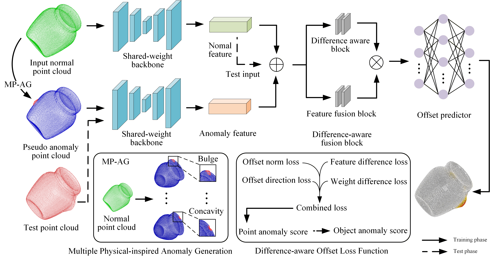

# PA3AD: Physics-inspired Pseudo Anomaly Generation and Prototype Feature Guidance for 3D Anomaly Detection

<p align="center">
  <a href="#-news"></a>
  <a href="#-installation"></a>
  <a href="#-installation"></a>
  <a href="LICENSE"></a>
</p>

Official repository for the paper **"Physics-inspired Pseudo Anomaly Generation and Prototype Feature Guidance for 3D Anomaly Detection"**. 

3D point cloud anomaly detection plays a vital role in industrial manufacturing but faces significant challenges due to the scarcity and high acquisition cost of real anomalous samples. To address the difficulty of learning discriminative features from inherently anomaly-free training data, we propose **PA3AD**.

## 📢 News
- **[2026-05]** Source code is released!
- **[2026-03]** The repository is created.
- **[2026-03]** Our paper has been submitted to *Pattern Recognition*.

## 💡 Key Innovations

PA3AD tackles the scarcity of real anomalies and distribution shifts through two core designs:
1. **Physics-Inspired Pseudo-Anomaly Generation**: A novel module that creates diverse, physically plausible pseudo-anomalous point clouds from normal data via multi-physics modeling.
2. **Prototype Feature Guidance**: We incorporate momentum-updated prototypes and a difference-aware fusion block via a weight-sharing mechanism. This effectively captures stable normal representations and their discrepancies with pseudo-anomalies.

<p align="center">
  
</p>

## 📂 Datasets

Our method is evaluated on the following standard industrial benchmarks:
- **Anomaly-ShapeNet**
- **Real3D-AD**

Please organize the datasets as follows:

```
PA3AD/
├── datasets/
│   ├── AnomalyShapeNet/
│   │   └── dataset/
│   │       ├── obj/
│   │       │   ├── ashtray0/
│   │       │   │   ├── template_0.obj
│   │       │   │   └── ...
│   │       │   ├── bottle0/
│   │       │   └── ...
│   │       └── pcd/
│   │           ├── ashtray0/
│   │           │   ├── test/
│   │           │   │   ├── positive_xxx.pcd
│   │           │   │   └── negative_xxx.pcd
│   │           │   └── GT/
│   │           │       └── negative_xxx.txt
│   │           └── ...
│   └── Real3D/
│       └── Real3D-AD-PLY/
│           ├── airplane/
│           │   ├── template_0.ply
│           │   └── ...
│           ├── candybar/
│           └── ...
```

## 🛠️ Installation

```bash
git clone https://github.com/NingxiaoJian/PA3AD.git
cd PA3AD
```

**Option 1: Conda (recommended)**
```bash
conda env create -f environment.yml
conda activate PA3AD
```

**Option 2: Pip**
```bash
# First install PyTorch with CUDA 11.8
conda install pytorch==2.3.1 torchvision==0.18.1 torchaudio==2.3.1 pytorch-cuda=11.8 -c pytorch -c nvidia
# Then install other dependencies
pip install -r requirements.txt
```

## 🚀 Training

**Anomaly-ShapeNet:**
```bash
python PA3AD_training.py --dataset AnomalyShapeNet --category ashtray0 --batch_size 16 --epochs 2000 --lr 0.001 --optimizer AdamW --backbone_arch MinkUNet34TransformerLocalGlobal --logpath ./log/AnomalyShapeNet/ashtray0/ --use_shared_backbone --data_repeat 100
```

**Real3D-AD:**
```bash
python PA3AD_training.py --dataset Real3D --category airplane --batch_size 16 --epochs 2000 --lr 0.001 --optimizer AdamW --backbone_arch MinkUNet34TransformerLocalGlobal --logpath ./log/Real3D/airplane/ --use_shared_backbone --data_repeat 100
```

## 📊 Evaluation

**Anomaly-ShapeNet:**
```bash
python PA3AD_eval.py --dataset AnomalyShapeNet --category ashtray0 --backbone_arch MinkUNet34TransformerLocalGlobal --logpath ./weights/AnomalyShapeNet/ --checkpoint_name ashtray0_model.pth --use_shared_backbone
```

**Real3D-AD:**
```bash
python PA3AD_eval.py --dataset Real3D --category airplane --backbone_arch MinkUNet34TransformerLocalGlobal --logpath ./weights/Real3D/ --checkpoint_name airplane_model.pth --use_shared_backbone
```

Download the weights and place them in the corresponding directory:
```
weights/
├── AnomalyShapeNet/
│   └── ashtray0_model.pth
└── Real3D/
    └── ...
```

## 📦 Pretrained Weights

| Category | Download |
|----------|----------|
| ashtray0 | [Google Drive](https://drive.google.com/file/d/1sCk8o3XTS7_NjY_OURTr7XerZdq6y6Gs/view?usp=drive_link) |
| bag0 | [Google Drive](https://drive.google.com/file/d/1gjQMivC8u59qOa-I6wGvWFaOV94Kotpe/view?usp=drive_link) |
| bottle0 | [Google Drive](https://drive.google.com/file/d/1-mW7qW5eD81WmgIExwRgFTZMlv0qmmaK/view?usp=drive_link) |
| bottle1 | [Google Drive](https://drive.google.com/file/d/1Jqz4j0kR5geZXZB4L6GFBJLTbO5E5fKX/view?usp=drive_link) |
| bottle3 | [Google Drive](https://drive.google.com/file/d/1xqN9geT0jOY7UIaLeFnPq3bEEBVGb3jG/view?usp=drive_link) |
| bowl0 | [Google Drive](https://drive.google.com/file/d/1B9PLXmyUfZngDiqKsh6LH1aqpOyeg0aQ/view?usp=drive_link) |
| bowl1 | [Google Drive](https://drive.google.com/file/d/1lwOQI_JE5BdHq7LPm20LQPj3DS9esnR3/view?usp=drive_link) |
| bowl2 | [Google Drive](https://drive.google.com/file/d/17ZVa-NShIDstrG3KnFgovHEU_8Cjwxjf/view?usp=drive_link) |
| bowl3 | [Google Drive](https://drive.google.com/file/d/1YbzYuV3tW1QfaOHhTjtoy24S_NsgnbfX/view?usp=drive_link) |
| bowl4 | [Google Drive](https://drive.google.com/file/d/17NYd1_EPY86Xw085fmpxaM17pD6Cw0k8/view?usp=drive_link) |
| bowl5 | [Google Drive](https://drive.google.com/file/d/1rnHkPuREAxi9kbTnWTM1KZAggGv5ZAYL/view?usp=drive_link) |
| bucket0 | [Google Drive](https://drive.google.com/file/d/1DjG25l_Njo9eltz-7HXVaBSOoW6RXoLY/view?usp=drive_link) |
| bucket1 | [Google Drive](https://drive.google.com/file/d/1PMnojniHSTqJvcpc_5-QJYqxFeTVb8hP/view?usp=drive_link) |
| cap0 | [Google Drive](https://drive.google.com/file/d/1_ellhzCVmAg3XilZXqYlqi00HUs11bxf/view?usp=drive_link) |
| cap3 | [Google Drive](https://drive.google.com/file/d/1oyB8_-KHjQgIgwOzEqUpVYu7NpIoIim2/view?usp=drive_link) |
| cap4 | [Google Drive](https://drive.google.com/file/d/1kPMjiaPfV7zcyWWCWFXQRu6f7XbV3bCd/view?usp=drive_link) |
| cap5 | [Google Drive](https://drive.google.com/file/d/1UvquQOx68vQEn90ymVZ6vWgWhZj95KVw/view?usp=drive_link) |
| cup0 | [Google Drive](https://drive.google.com/file/d/192QJ12YMpIRRm8j5aKCn053GfTdpmD7S/view?usp=drive_link) |
| cup1 | [Google Drive](https://drive.google.com/file/d/1f-NfRG2oXS74TWbaQsufS7a-iTvoE0f-/view?usp=drive_link) |
| eraser0 | [Google Drive](https://drive.google.com/file/d/1TBTUtmxxSaKrpvihvOF1mIsm013scaa_/view?usp=drive_link) |
| headset0 | [Google Drive](https://drive.google.com/file/d/16FPVo-jSbX1NhFeMCJg2JrXniJE56EHZ/view?usp=drive_link) |
| headset1 | [Google Drive](https://drive.google.com/file/d/1zXCEudbR06pqg2sgdT1vSwVYD2YyG5Hp/view?usp=drive_link) |
| helmet0 | [Google Drive](https://drive.google.com/file/d/1oglps-nf7StKFiKqYVjUyIfKU7Vhv1Wp/view?usp=drive_link) |
| helmet1 | [Google Drive](https://drive.google.com/file/d/10frBDX9dAk9bPFM0C1lEH9QlmoK2hu6K/view?usp=drive_link) |
| helmet2 | [Google Drive](https://drive.google.com/file/d/1XOF_NiAqfjJ9FXH_VoLViWchD2ZrVKP3/view?usp=drive_link) |
| helmet3 | [Google Drive](https://drive.google.com/file/d/1Pys4l0cbeOtq_mEGZW4_gcLeC5opMnAw/view?usp=drive_link) |
| jar0 | [Google Drive](https://drive.google.com/file/d/10FM0lQdpiAG1GGLQw6GfOMEhiXFEamaF/view?usp=drive_link) |
| microphone0 | [Google Drive](https://drive.google.com/file/d/16Z_tqrlFRaNOkgv80FXwKcy2GsVJnXut/view?usp=drive_link) |
| shelf0 | [Google Drive](https://drive.google.com/file/d/1woTGi-coU4-_ovmSYI3D5zxyyjhuZnq9/view?usp=drive_link) |
| tap0 | [Google Drive](https://drive.google.com/file/d/1_bYBbeCFk2Uqhcp7PiZNI8_wBcPEQUyc/view?usp=drive_link) |
| tap1 | [Google Drive](https://drive.google.com/file/d/1cn3WrSO0dEFAV61Fyt4x_Fu4PBU_dTAn/view?usp=drive_link) |
| vase0 | [Google Drive](https://drive.google.com/file/d/1AmnElWrAasS2iMYiNC4vFlQsVWxS8KCp/view?usp=drive_link) |
| vase1 | [Google Drive](https://drive.google.com/file/d/1-F9IT4NUHHYaoAENcYw9GYEN4UIkt1n5/view?usp=drive_link) |
| vase2 | [Google Drive](https://drive.google.com/file/d/1j6KphLrlbkwYm2vqZQe4AnABVcQNlP2N/view?usp=drive_link) |
| vase3 | [Google Drive](https://drive.google.com/file/d/1td5_f5J3t3FWwgPDKeiLqZgGlBPjp68m/view?usp=drive_link) |
| vase4 | [Google Drive](https://drive.google.com/file/d/1G6s6KPHj1mAQlvbS1VLVHtjp0-Q29YcJ/view?usp=drive_link) |
| vase5 | [Google Drive](https://drive.google.com/file/d/1ZdbfudjDg8M27do-62Cq940h9jvGE0lK/view?usp=drive_link) |
| vase7 | [Google Drive](https://drive.google.com/file/d/1QzKBV7aVkwRsSqObBxMGeFv3Ezgyy_z6/view?usp=drive_link) |
| vase8 | [Google Drive](https://drive.google.com/file/d/13mTq9xcyLf3RR5BqQFbl8n6l3AzOTiuR/view?usp=drive_link) |
| vase9 | [Google Drive](https://drive.google.com/file/d/1QSCxTVWDevW6g70Nf2nxohE2LxzvRkog/view?usp=drive_link) |


## 📄 Citation


## 📜 License

This project is licensed under the MIT License - see the [LICENSE](LICENSE) file for details.

